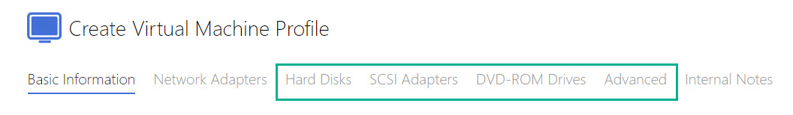

### Task 1

---

This task will provide the instructions to build the VM Profile.  Items in *italics* are parts that are different from settings you might have traditionally used when building VM profiles for Hyper-V or ESX.

 - From the main Skillable Studio menu bar select **Admin**
 - From the Admin page select **Create Virtual Machine Profile**
 [Create VM image](images/001.jpg)
 
 - Complete the Virtual Machine Profile with the following settings:
 
 #### Basic Information:
 
 > - Name: ++@lab.Variable(initials)-AWS-VM++    
 > - Series: LDW-AUG22    
 > - Platform: *AWS*    
 > - *Machine Type: t2.medium (2 Cores, 4GB Memory)*    
 > - *Machine Image Image Name: ++WinServer-2019-Browser Update and Notepad plus plus++*    
 > - *Location/Region: US East (Virgina)*
 > - *Machine Owner Account: ++701100994537++*    
 > - Username: ++Administratpr++    
 > - Password: ++6GL$P?qF=(TywTC8zBrs*zo96s2vu7=(++    
 
>[!TIP]The image name was set when creating the AMI as shown in the video.

>[!KNOWLEDGE] Notice the pages that are missing compared to Hyper-V or ESX VM's    
>

Press **Next** to continue
 
